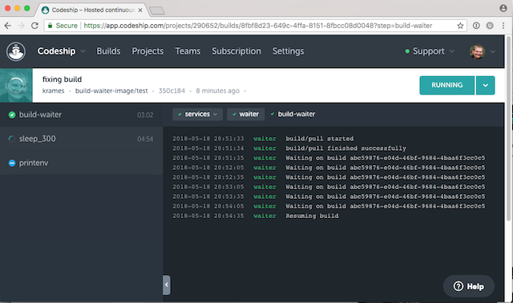

[ ](https://app.codeship.com/projects/290652)

[](https://github.com/codeship/documentation/blob/master/LICENSE.md)

# build-waiter

The docker image [codeship/build-waiter](https://hub.docker.com/r/codeship/build-waiter/) can be used to wait for outstanding builds on the current branch to be completed before resuming the current build.



## Usage

Add the build-waiter service to your `codeship-services.yml`:

``` yaml
app:
  build:
    dockerfile_path: Dockerfile
waiter:
  image: codeship/build-waiter
  encrypted_env_file: waitercfg.encrypted
```

Add the a step to your `codeship-steps.yml` to call the build-waiter in the approprate spot:

``` yaml
- service: waiter
  command: build-waiter
  tag: ^master$
- service: app
  command: sleep 300
- service: app
  command: printenv
```

To only have the waiter wait on certain branches you can add use a tag directive.
In our above example, the waiter would only be present for master branches.

Add `waitercfg.encrypted` file containing the following environment variables:

```
CODESHIP_USERNAME=user@codeship.com
CODESHIP_PASSWORD=password123
CODESHIP_ORGANIZATION=acme
```

Note that the `CODESHIP_ORGANIZATION` should contain the organization the project resides in.


## Contributing

We are happy to hear your feedback. Please read our [contributing guidelines](CONTRIBUTING.md) and the [code of conduct](CODE_OF_CONDUCT.md) before you submit a pull request or open a ticket.

If you have any questions regarding your projects on Codeship, or general features and supported workflows, please take a look at [how to get help](SUPPORT.md) instead.
